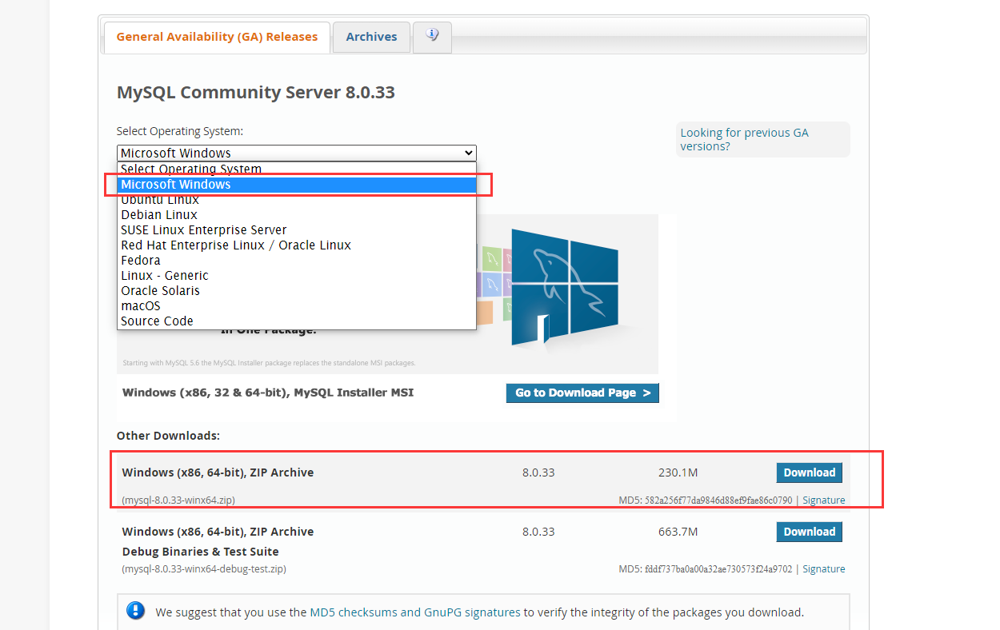
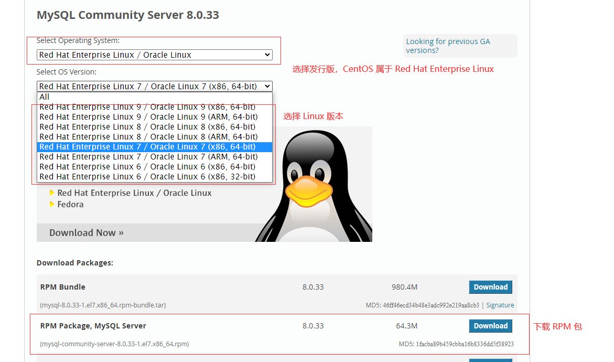

# 一、下载安装
## 1. docker 方式
  运行镜像
```shell
# Linux 、Windows 下命令基本一致，只是目录结构不同，Windows 需要将 -v /usr/local/mysql/log: 等修改为本地磁盘目录，例如:-v D:\mysql\log
docker run -p 3306:3306 --name mysql \
	-v /usr/local/mysql/log:/var/log/mysql \
	-v /usr/local/mysql/data:/var/lib/mysql \
	-v /usr/local/mysql/conf:/etc/mysql/conf.d \
    --privileged=true \
	-e MYSQL_ROOT_PASSWORD=y9i-83204585 \
	-d mysql:8.0.33
```
命令注释：       
-p 3306:3306 端口映射：前表示主机部分，后表示容器部分。              
--name mysql 指定该容器名称，查看和进行操作都比较方便。               
-v 挂载目录，规则与端口映射相同，目的是将容器内配置文件映射到外部。      
-e MYSQL_ROOT_PASSWORD 为设置 root 账号的默认密码。           
-d mysql:8.0.33 表示后台启动 mysql:8.0.33。  

## 2. windows 下安装
1)  前往 [MySQL 官网下载地址](https://dev.mysql.com/downloads/mysql/)，下载 **MySQL 8.0.33** windows版本压缩包
   
    详细安装步骤请参照：[MySQL官方文档](https://dev.mysql.com/doc/refman/8.0/en/installing.html)  ,或者中文文档[MySQL安装教程](https://www.runoob.com/mysql/mysql-install.html) 
## 3. linux 下安装
1) 前往 [MySQL 官网下载地址](https://dev.mysql.com/downloads/mysql/)，找到 **MySQL 8.0.33版本** ，根据当前系统的发行版和版本，选择合适的安装包。  
以 **CentOS** 为例，
    
    详细安装步骤请参照：[MySQL官方文档](https://dev.mysql.com/doc/refman/8.0/en/installing.html) ,或者中文文档[MySQL安装教程](https://www.runoob.com/mysql/mysql-install.html)
# 二、修改配置
### 1). 修改配置文件
windows 版本是在根目录下的 my.ini 文件，linux 是在 /etc/my.conf，docker 安装是在自己映射的目录下，本文在 /usr/local/mysql/conf （如果没有，就自己创建）

```shell
[client]
default-character-set=utf8mb4
[mysql]
default-character-set=utf8mb4
[mysqld]
init_connect='SET collation_connection = utf8mb4_bin'
init_connect='SET NAMES utf8mb4'
character_set_server = utf8mb4
collation_server = utf8mb4_bin
```

### 2. 验证
查看mysql的字符集命令：show variables where Variable_name like '%char%';
```shell
# 重启 MySQL
systemctl restart mysql
# 进入MySQL，执行命令
mysql -u root -p
mysql> show variables like '%char%';
+--------------------------------------+----------------------------+
| Variable_name                        | Value                      |
+--------------------------------------+----------------------------+
| character_set_client                 | utf8mb4                    |
| character_set_connection             | utf8mb4                    |
| character_set_database               | utf8mb4                    |
| character_set_filesystem             | binary                     |
| character_set_results                | utf8mb4                    |
| character_set_server                 | utf8mb4                    |
| character_set_system                 | utf8mb4                    |
| character_sets_dir                   | /usr/share/mysql/charsets/ |
| validate_password_special_char_count | 1                          |
+--------------------------------------+----------------------------+     
```
显示如上，代表修改完成。

# 三、常用命令
## 1. docker 
```shell
docker start <contain_name> # 启动容器
docker stop <contain_name> # 停止
docker restart <contain_name> # 重启
docker status <contain_name> # 查看日期状态
docker logs <contain_name>  # 查看日志
docker ps   # 查看当前运行容器
docker ps -a # 查看所有容器
docker rm <contain_name> # 移除容器 
docker rmi <contain_name> # 移除镜像 
docker exec -it <contain_name> /bin/bash # 进入容器内部  
docker pull <image_name:version> # 拉取镜像

```
## 2. linux
```shell
systemctl start <service_name> # 启动
systemctl stop <service_name> # 停止
systemctl restart <service_name> # 重启
systemctl status <service_name> # 查看服务状态
systemctl enable <service_name> # 开机启动
```