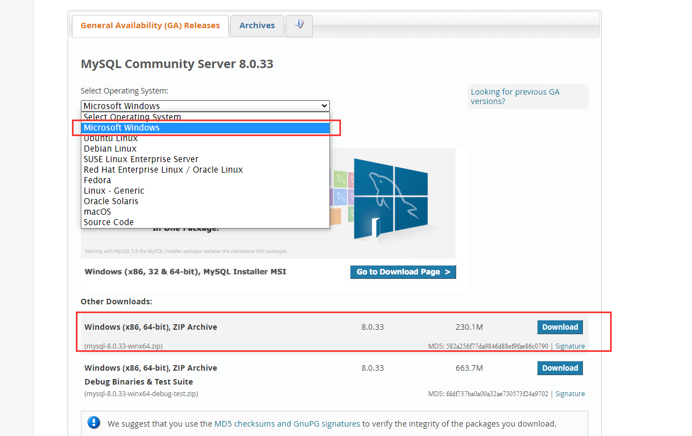

# 版本说明

| 工具               | 版本         | 说明                             |
|------------------|------------|--------------------------------|
| MySQL            | 5.7 / 8.0+ | 用户：root，密码：111111  (忽略大小写)     |
| Redis            | 6.2+       | 端口：6379，密码：y9i-83204585        |
| Kafka            | 2.6+       | 端口：9092                        |
| elasticsearch    | 7.9+       | 用户：elastic，密码：risesoft，端口：9200 |
| filezilla server | 1.7+       | 用户：y9admin，密码：83204585，端口：21   |
| Tomcat           | 9.0.+      | 端口：7055                        |

> 注意：上面表格中的***说明***均为数字底座默认使用的配置，如果安装中间件的时候设置的用户、密码、端口和默认的不一致，需要修改配置文件中的参数。

# MySQL

## 一、下载安装

### 1. docker 方式

  运行镜像

```shell
docker run -p 3306:3306 --name mysql \
-v mysql_log:/var/log/mysql \
-v mysql_data:/var/lib/mysql \
-v mysql_conf:/etc/mysql/conf.d \
--privileged=true \
-e MYSQL_ROOT_PASSWORD=111111 \
-d mysql:8.0.33 --lower_case_table_names=1
```

> 命令注释：       
> -p 3306:3306 端口映射：前表示主机部分，后表示容器部分。              
> --name mysql 指定该容器名称，查看和进行操作都比较方便。                
> -e MYSQL_ROOT_PASSWORD 为设置 root 账号的默认密码。           
> -d mysql:8.0.33 表示后台启动 mysql:8.0.33。  
> -v 挂载目录，将:后目录挂载至:前的目录中，将容器内配置文件映射到宿主机。可通过 docker volume inspect mysql_data
> 查看目录。  
> 所有挂载卷目录默认位于 linux：/var/lib/docker/volumes 下,windows: 资源管理器
> \\wsl$\docker-desktop-data\data\docker\volumes 下

### 2. windows 下安装

1)  前往 [MySQL 官网下载地址](https://dev.mysql.com/downloads/mysql/)，下载 **MySQL 8.0.33** windows版本压缩包
   
    详细安装步骤请参照：[MySQL官方文档](https://dev.mysql.com/doc/refman/8.0/en/installing.html)  ,或者中文文档[MySQL安装教程](https://www.runoob.com/mysql/mysql-install.html) 

### 3. linux 下安装

1) 前往 [MySQL 官网下载地址](https://dev.mysql.com/downloads/mysql/)，找到 **MySQL 8.0.33版本** ，根据当前系统的发行版和版本，选择合适的安装包。  
以 **CentOS** 为例，
    
    详细安装步骤请参照：[MySQL官方文档](https://dev.mysql.com/doc/refman/8.0/en/installing.html) ,或者中文文档[MySQL安装教程](https://www.runoob.com/mysql/mysql-install.html)

# Redis

## 一、  下载安装

### 1. docker 安装

```shell
docker run -p 6379:6379 --name redis \
-v redis_conf:/etc/redis \
-v redis_data:/data \
-d redis redis-server \
--appendonly yes
```

命令注释：       
> -p 6379:6379 端口映射：前表示主机部分，：后表示容器部分。             
> --name redis 指定该容器名称，查看和进行操作都比较方便。              
> -d redis 表示后台启动redis。       
> --appendonly yes 开启redis 持久化  
> -v 挂载目录，将:后目录挂载至:前的目录中，将容器内配置文件映射到宿主机。可通过 docker volume inspect redis_data
> 查看目录。  
> 所有挂载卷目录默认位于 linux：/var/lib/docker/volumes 下,windows: 资源管理器
> \\wsl$\docker-desktop-data\data\docker\volumes 下

### 2. windows 安装
下载并解压 [redis6.2.11 安装包](https://vue.youshengyun.com/storage/s/1532060136737083392.zip)     
解压完成后直接启动即可。
```shell
# 前往 redis 根目录下，cmd 窗口执行，已设置默认密码 y9i-83204585，与本地化生成代码配置一致，无需后续步骤
redis-server.exe redis.windows.conf
```
### 3. linux 安装
1）下载地址：[redis 官方下载地址](https://download.redis.io/releases/)下载版本 **redis-6.2.11** 并上传服务器，也可以使用 wget 下载。
以 **CentOS** 为例, 其他发行版请参考 [redis 官方文档](https://redis.io/docs/getting-started/installation/install-redis-on-linux/)
```shell
[root@localhost local]# wget https://download.redis.io/releases/redis-6.2.11.tar.gz
# 解压、重命名
[root@localhost local]# tar -zxvf redis-6.2.11.tar.gz
[root@localhost local]# mv /usr/local/redis-6.2.11 /usr/local/redis
```
2）编译和安装,redis 根目录下执行 make，make install 命令
```shell
[root@localhost redis]# make
[root@localhost redis]# make install
```

3）前往 redis 根目录启动redis。

```shell
[root@localhost redis]# ./src/redis-server ./redis.conf
# 验证
[root@localhost redis]# ps -ef|grep redis
root      9081     1  0 20:14 ?        00:00:00 redis-server 127.0.0.1:6379
root      9091  1529  0 20:15 pts/0    00:00:00 grep --color=auto redis
```

## 二、 修改配置

Windows,docker 环境无需配置，以下为 Linux 环境下的配置：
> 配置文件默认在 redis 根目录下 redis.conf，下列为配置项的作用：     
> 允许后台启动： 编辑文件，将daemonize属性改为yes   
> 修改密码：修改 requirepass y9i-83204585  
> 允许远程访问：编辑redis.conf文件，找到bind 127.0.0.1 -::1配置，用#号注释掉即可  
> redis持久化：appendonly yes  
> 修改完成后**重启**redis


# Kafka

## 一、 下载安装

### 1. docker 方式

```shell
# 首先下载运行 zookeeper
[root@localhost ~]# docker run -d --restart=always --log-driver json-file --log-opt max-size=100m \
--log-opt max-file=2  --name zookeeper -p 2181:2181 -v /etc/localtime:/etc/localtime zookeeper:3.6
# 下载运行 kafka
[root@localhost ~]# docker run -d --name kafka --publish 9092:9092 --link zookeeper \
-e KAFKA_BROKER_ID=1  -e KAFKA_ADVERTISED_HOST_NAME=127.0.0.1  -e KAFKA_ZOOKEEPER_CONNECT=zookeeper:2181 \
-e KAFKA_ADVERTISED_PORT=9092 -e KAFKA_ADVERTISED_LISTENERS=PLAINTEXT://localhost:9092 \
-e ALLOW_PLAINTEXT_LISTENER=yes \
-v kafka_data:/bitnami \
--restart=always  -t  bitnami/kafka:2.6.0
```

命令注释：
> -p 9092:9092 端口映射：前表示主机部分，：后表示容器部分。             
> -e KAFKA_ADVERTISED_HOST_NAME=127.0.0.1   **服务器上需要修改为ip地址**    
> -e KAFKA_ZOOKEEPER_CONNECT=zookeeper:2181 连接到 zookeeper 容器
> -v 挂载目录，将:后目录挂载至:前的目录中，将容器内配置文件映射到宿主机。可通过 docker volume inspect kafka_data
> 查看目录。  
> 所有挂载卷目录默认位于 linux：/var/lib/docker/volumes 下,windows: 资源管理器
> \\wsl$\docker-desktop-data\data\docker\volumes 下

### 2. windows 下安装

下载并解压 **kafka 2.6.0** [kafka 官方下载地址](https://archive.apache.org/dist/kafka/)

1) 运行 zookeeper.     
   打开 windows 命令行 cmd，进入 kafka 根目录目录并执行 bin\windows\zookeeper-server-start.bat
   config\zookeeper.properties 命令启动zookeeper

```shell
C:\soft\kafka_2.13-2.6.0>  bin\windows\zookeeper-server-start.bat config\zookeeper.properties
```

2) 运行kafka.     
   打开另一个 windows 命令行 cmd，进入 kafka 根目录目录并执行 bin\windows\kafka-server-start.bat config\server.properties
   命令启动kafka-server
```shell
C:\soft\kafka_2.13-2.6.0>  bin\windows\kafka-server-start.bat config\server.properties
```
3) 测试验证     
   创建一个 topic：开启另一个 cmd 并执行 bin\windows\kafka-topics.bat --bootstrap-server 127.0.0.1:9092 --create --topic test-topic      ,控制台输出 Created topic test-topic 代表启动成功。
```shell
C:\soft\kafka_2.13-2.6.0> bin\windows\kafka-topics.bat --bootstrap-server 127.0.0.1:9092 --create --topic test-topic
Created topic test-topic.
```
### 3. linux 下安装
下载 **kafka 2.6.0** tgz压缩包并上传至服务器 [kafka 官方下载地址](https://archive.apache.org/dist/kafka/)，或直接使用 wget 下载。
以 **CentOS** 为例，详情可参考[kafka 官方文档](https://kafka.apache.org/documentation/#quickstart)
```shell
[root@k8smaster local]# wget https://archive.apache.org/dist/kafka/2.6.0/kafka_2.13-2.6.0.tgz
# 解压
[root@k8smaster local]# tar -xvf kafka_2.13-2.6.0.tgz 
# 后台启动 zookeeper，将 /usr/local 替换成自己安装的路径
[root@k8smaster kafka_2.12-3.4.0]# /usr/local/kafka_2.13-2.6.0/bin/zookeeper-server-start.sh /usr/local/kafka_2.13-2.6.0/config/server.properties &
# 后台启动 kafka，将 /usr/local 替换成自己安装的路径
[root@k8smaster kafka_2.12-3.4.0]# /usr/local/kafka_2.13-2.6.0/bin/kafka-server-start.sh /usr/local/kafka_2.13-2.6.0/config/server.properties
```


# Elasticsearch
## 一、下载安装
### 1. docker 方式.

```shell
docker run --name elasticsearch \
-d -e ES_JAVA_OPTS="-Xms512m -Xmx512m" \
-e "discovery.type=single-node" \
-e "ELASTIC_PASSWORD=risesoft"  \
-e "xpack.security.enabled=true" \
-e "xpack.security.transport.ssl.enabled=false" \
-v elastic_config:/usr/share/elasticsearch/config \
-v elastic_data:/usr/share/elasticsearch/data \
-v elastic_plugins:/usr/share/elasticsearch/plugins \
--privileged \
-p 9200:9200 -p 9300:9300 \
elasticsearch:7.9.3
```

命令注释：
> -e ES_JAVA_OPTS="-Xms512m -Xmx512m"  设置ES内存大小。
> -e "xpack.security.enabled=true" 开启账号密码认证
> -v 挂载目录，将:后目录挂载至:前的目录中，将容器内配置文件映射到宿主机。可通过 docker volume inspect elastic_data
> 查看目录。  
> 所有挂载卷目录默认位于 linux：/var/lib/docker/volumes 下,windows: 资源管理器
> \\wsl$\docker-desktop-data\data\docker\volumes 下

### 2.windows方式

1) 下载
   前往官网 [Elasticsearch 下载地址](https://www.elastic.co/cn/downloads/past-releases#elasticsearch) 下载windows版本 *
   *elasticsearch 7.9.3** 并解压
2) 启动
   前往 bin 目录，双击 elasticsearch.bat 启动,默认端口 9200  
     
   启动完成后，访问 http://localhost:9200 验证  
   

### 3. linux 方式
前往官网 [Elasticsearch 下载地址](https://www.elastic.co/cn/downloads/past-releases#elasticsearch) 下载版本 **elasticsearch 7.9.3** 对应的 linux 安装包,或使用 wget 命令下载  
详细步骤可参照 [Elasticsearch 官方文档](https://www.elastic.co/guide/en/elasticsearch/reference/7.9/targz.html#targz-enable-indices)  
**注意事项**  
ES 默认不能使用 root 用户启动  
**解决方式**
```
# 切换其他用户，没有则新建
adduser elastic // 新建用户  
passwd risesoft // 设置密码    
chown -R elastic:elastic <es所在文件夹>  // 将es的拥有者和group改为elastic  
su elastic  // 切换到子用户elastic
```
## 二、修改配置

docker环境无需修改，以下为 windows和linux环境配置修改：  
修改 elasticsearch/config/elasticsearch.yml 文件。最下方添加：
> http.cors.enabled: true  
> http.cors.allow-origin: "*"  
> http.cors.allow-headers: Authorization
**linux注意事项** :
> linux 系统需要开启远程访问,配置环境：
```shell
vi /etc/security/limits.conf
# 文本最后加上
* soft nofile 65535
* hard nofile 65535
```

```shell
vi /etc/sysctl.conf
# 文本最后加上
fs.file-max=655350
vm.max_map_count=262144
# 执行命令后生效
sysctl -p 
```
 修改 elasticsearch/config/elasticsearch.yml 文件
```shell
# 修改 network.host 为 0.0.0.0，取消注释
network.host: 0.0.0.0
# cluster.initial_master_nodes 默认为注释，取消注释即可
cluster.initial_master_nodes: ["node-1", "node-2"]
```
完成后，重启 ES （linux需要重新登录）
#  FTP服务器
## 1.Windows版本
（1） 下载filezilla server和client

https://filezilla-project.org/download.php?type=server

https://filezilla-project.org/download.php?type=client

（2） 配置filezilla server

打开FileZilla Server Interface，添加用户y9admin，密码：83204585

设置共享目录：d:\y9config\y9filestore（没有则创建），允许所有权限。


## 2.linux 版本
(1) 下载 ftp   
根据系统发行版选择其中一个命令
```shell
# redhat 系
yum install -y vsftpd
# Ubuntu/Debian 系
apt install -y vsftpd
```
(2) 修改配置
编辑 /etc/vsftpd.conf 文件
```shell
vi /etc/vsftpd/vsftpd.conf
# 找到如下配置并修改
1.将是否允许匿名登录 FTP 的参数修改为anonymous enable=NO
2.将是否允许本地用户登录 FTP 的参数修改为local_enable=YES
3.指定ftp默认存放的目录
local_root=/software/y9config/y9filestore
userlist_file=/etc/vsftpd.chroot_list
# 取消如下配置前的注释符号：
local_enable=YES #（是否允许本地用户登录）
write_enable=YES #（是否允许本地用户写的权限）
chroot_local_user=YES #（是否将所有用户限制在主目录）
# 创建 ftp 登录用户,并授权目录
[root@k8smaster ~]# mkdir -p /software/y9config/y9filestore
[root@k8smaster ~]# sudo useradd -d /software/y9config/y9filestore -m y9admin
[root@k8smaster ~]# sudo chmod 777 /software/y9config/y9filestore
[root@k8smaster ~]# vim /etc/vsftpd.chroot_list # 输入 y9admin,保存退出
# 修改密码
[root@k8smaster ~]# passwd y9admin
Changing password for user y9admin.
New password:    #(输入密码 83204585 ） 回车
Retype new password:  #(输入密码 83204585 ） 回车
# 重启
[root@k8smaster ~]# systemctl restart vsftpd 
# 登录 ftp ，输入刚创建的账号和密码即可
[root@k8smaster ~]# ftp 服务器主机ip地址 
```

# Tomcat

## 一、 下载

### 1. docker 下安装

```shell
docker run -d -e TZ="Asia/Shanghai" -p 7055:7055  \
--name tomcat \
-v tomcat_webapps:/usr/local/tomcat/webapps \
-v tomcat_logs:/usr/local/tomcat/logs \
-v tomcat_conf:/usr/local/tomcat/conf \
--privileged=true \
tomcat:9.0.39
```

命令注释：
> -p 7055:7055 映射端口 7055，后续需要修改 tomcat 默认端口为7055
> -v 挂载目录，将:后目录挂载至:前的目录中，将容器内配置文件映射到宿主机。可通过 docker volume inspect tomcat_webapps
> 查看目录。  
> 所有挂载卷目录默认位于 linux：/var/lib/docker/volumes 下,windows: 资源管理器
> \\wsl$\docker-desktop-data\data\docker\volumes 下

### 2. windows 下安装.

下载并解压 [tomcat9.0.39 安装包](https://archive.apache.org/dist/tomcat/tomcat-9/v9.0.39/bin/apache-tomcat-9.0.39-windows-x64.zip)

> 注意：修改文件夹名，名字不能过长,否则可能启动失败。

### 3. linux 下安装.

以 **CentOS为例** ,其他发行版请参照[JDK 安装指南](https://docs.oracle.com/en/java/javase/11/install/overview-jdk-installation.html#GUID-8677A77F-231A-40F7-98B9-1FD0B48C346A)    
1) jdk 下载   
请先下载 jdk 11 并上传服务器 [jdk 下载地址](https://www.oracle.com/java/technologies/downloads/#java11)

```shell
# 解压
tar -zxvf jdk-11.0.19_linux-x64_bin.tar.gz
# 配置环境
vi /etc/profile
# 复制下列到文件最下方
export JAVA_HOME=/usr/java/jdk-11.0.19 #你自己的安装路径
export JRE_HOME=${JAVA_HOME} 
export CLASSPATH=.:${JAVA_HOME}/lib:${JRE_HOME}/lib
export PATH=${JAVA_HOME}/bin:$PATH
# 执行刷新配置
. /etc/profile
# 执行验证是否正确配置
java - version 
```

2) tomcat 下载安装
下载 **tomcat 9.0.39** 并上传服务器 [tomcat 官方下载](https://archive.apache.org/dist/tomcat/tomcat-9/)
或直接使用wget 命令下载  
以 **CentOS为例** ，其他发行版请参照[tomcat 安装指南](http://blog.fpliu.com/it/software/Tomcat),或者 [tomcat 官方文档](https://tomcat.apache.org/tomcat-9.0-doc/RUNNING.txt)

```shell
[root@k8smaster tomcat]# wget https://archive.apache.org/dist/tomcat/tomcat-9/v9.0.39/bin/apache-tomcat-9.0.39.tar.gz
# 解压、重命名
[root@k8smaster tomcat]# tar -zxvf apache-tomcat-9.0.39.tar.gz
[root@k8smaster tomcat]# mv apache-tomcat-9.0.39 tomcat9
# 前往 bin 目录，启动
[root@k8smaster bin]# ./startup.sh
```

## 二、 配置字符集

1.配置字符集

修改文件tomcat9/conf/server.xml

在 Connector里添加 URIEncoding="UTF-8"

```
<Connector port="7055" protocol="HTTP/1.1"
               connectionTimeout="20000"
               redirectPort="8443" URIEncoding="UTF-8"/>
```

2.控制台乱码  
修改 tomcat9/conf/logging.properties
> 注释掉 java.util.logging.ConsoleHandler.encoding = UTF-8

# 常用命令

### 1. docker

```shell
docker start <contain_name> # 启动容器
docker stop <contain_name> # 停止
docker restart <contain_name> # 重启
docker status <contain_name> # 查看日期状态
docker logs <contain_name>  # 查看日志
docker ps   # 查看当前运行容器
docker ps -a # 查看所有容器
docker rm <contain_name> # 移除容器 
docker rmi <contain_name> # 移除镜像 
docker exec -it <contain_name> /bin/bash # 进入容器内部  
docker pull <image_name:version> # 拉取镜像
docker volume ls # 查看docker卷列表
docker volume inspect <volume_name> # 查看docker卷详情（包括目录）
```

### 2. linux

```shell
systemctl start <service_name> # 启动
systemctl stop <service_name> # 停止
systemctl restart <service_name> # 重启
systemctl status <service_name> # 查看服务状态
systemctl enable <service_name> # 开机启动
```

